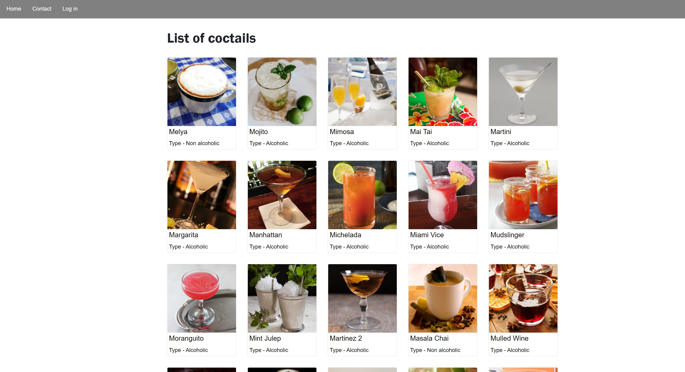

# JavaScript Frameworks CA



- Practicing React
- School project

## Description

- List of coctails retrieved from free public API.
- Details page.
- Login form (working with local version of WordPress installation)
- Form validation with yup


## Built With

- [React.js](https://reactjs.org/)
- [Bootstrap](https://getbootstrap.com)
- [Sass](https://sass-lang.com)

## Getting Started

### Installing


1. Clone the repo:

```bash
git clone git@github.com:Bockey/javascript-frameworks.git
```

2. Install the dependencies:

```
npm install
```

### Running

To run the app, run the following commands:

```bash
npm run start
```

## Contact

[My portfolio page](https://bockey.one/)

[My LinkedIn page](https://www.linkedin.com/in/boris-gudelj-a535091b4/)

